# PeerTalk Architecture

> Auto-generated by `/architecture` skill. Do not edit manually.

## System Context

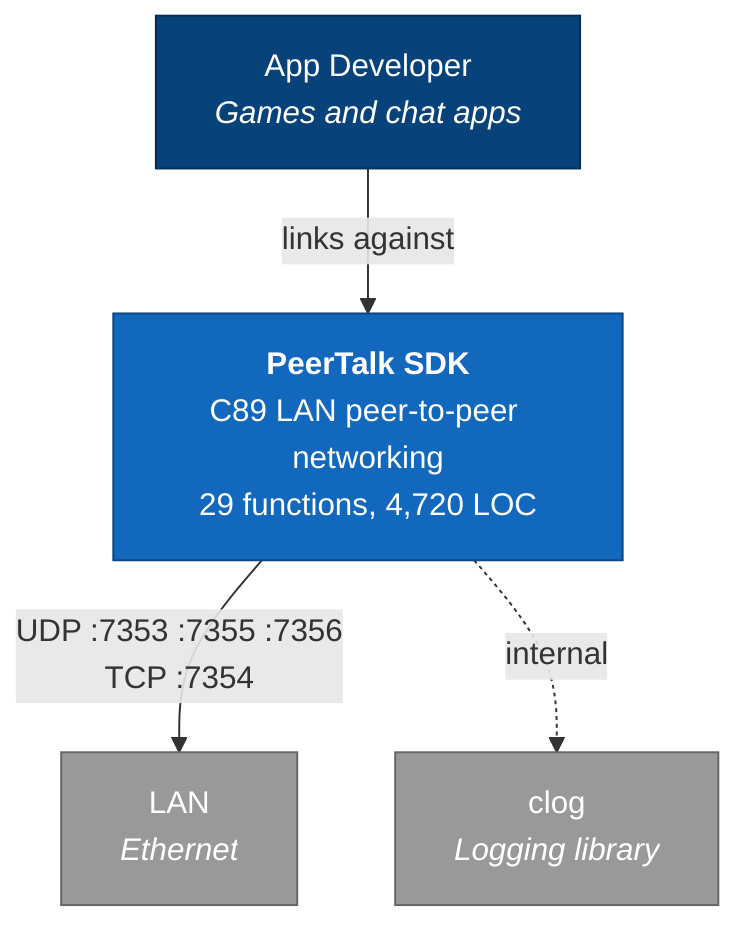

## Containers

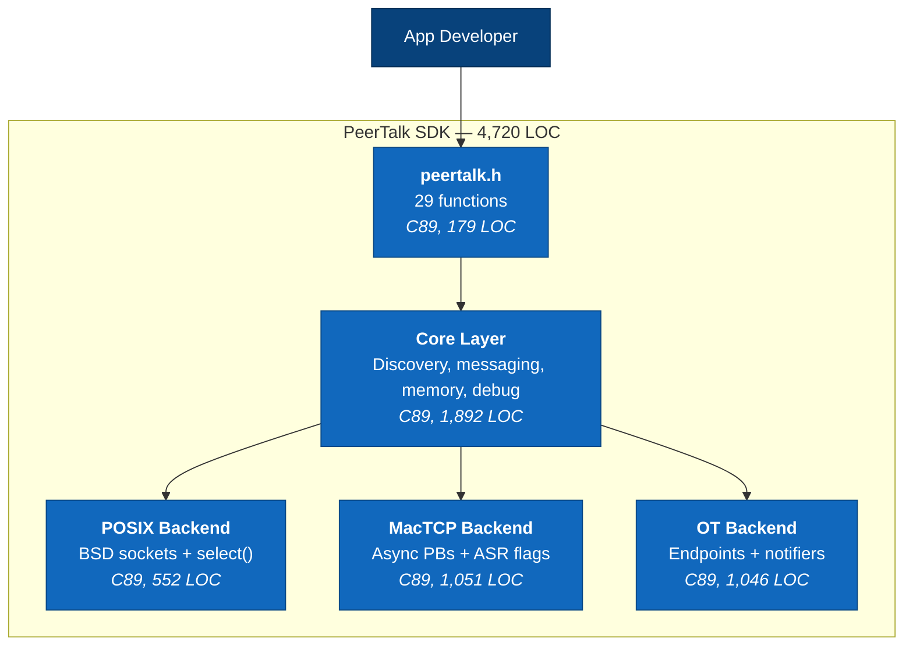

## Core Components

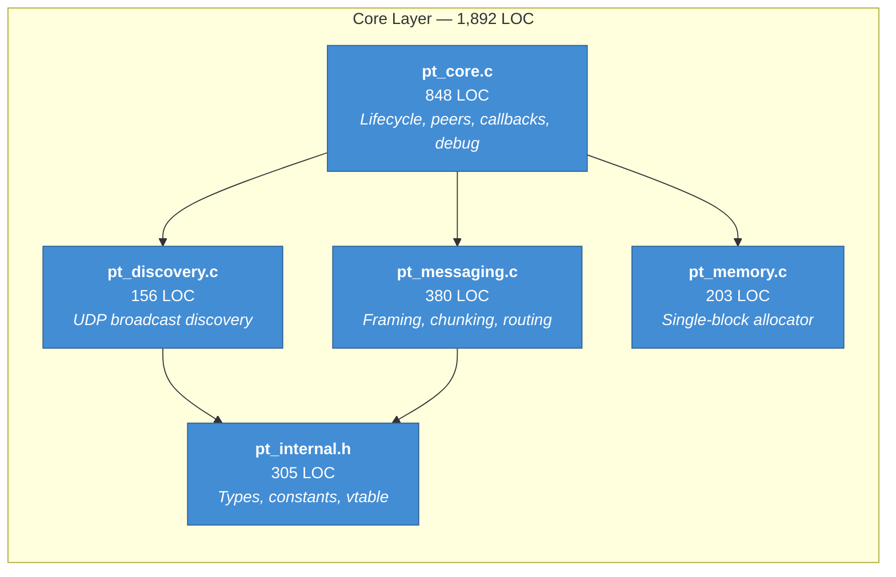

## Platform Backends

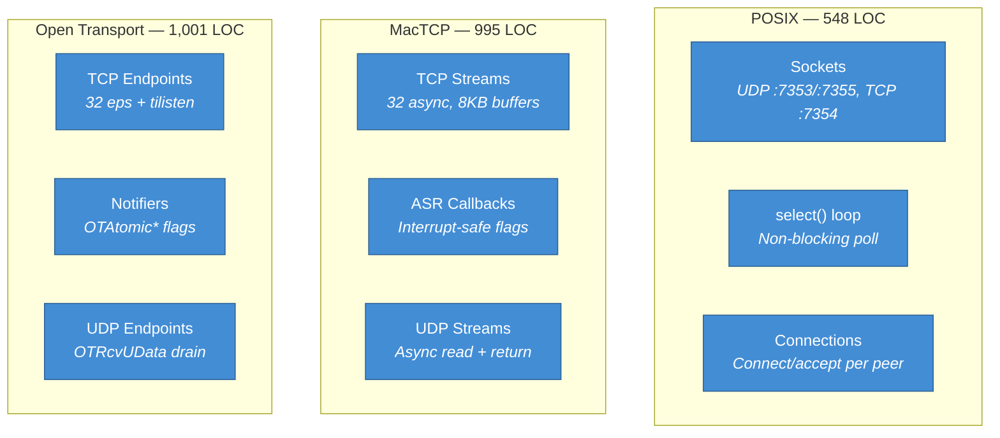

## Deployment

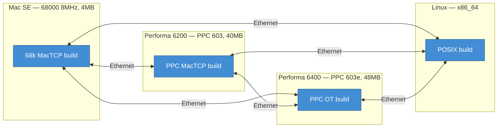

## Wire Protocol

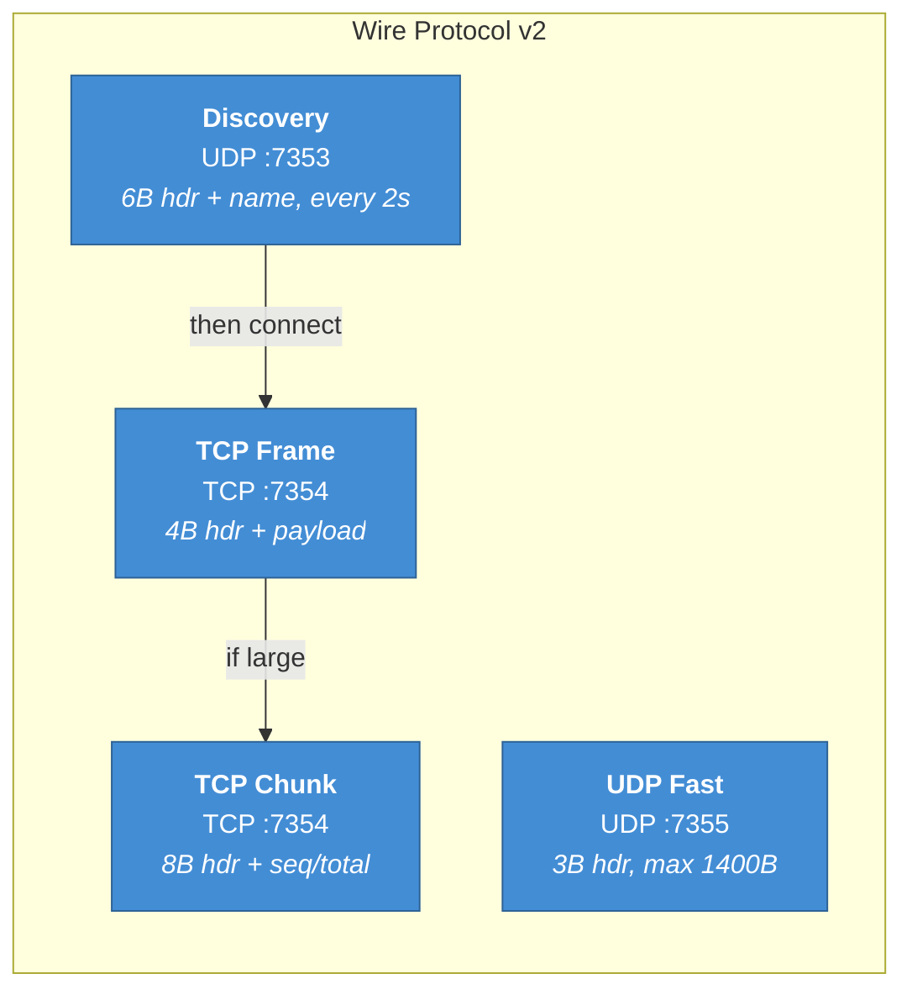

## Test Suite

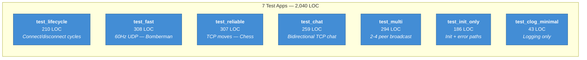

## Discovery and Connection Sequence

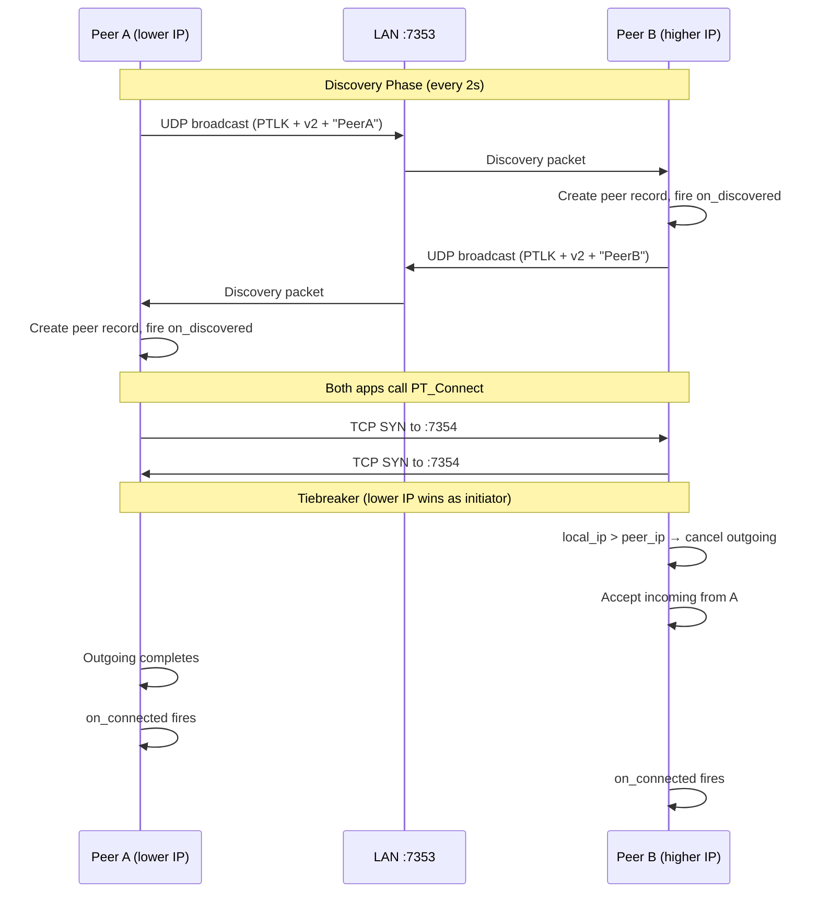

## Message Send/Receive Sequence

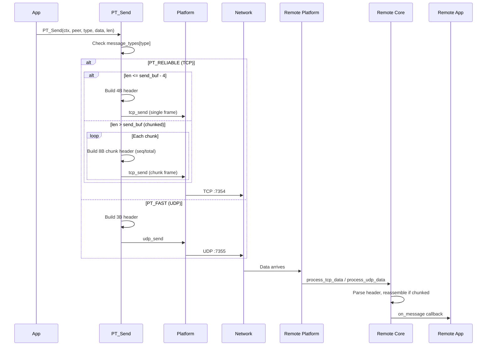

## Init Memory Layout

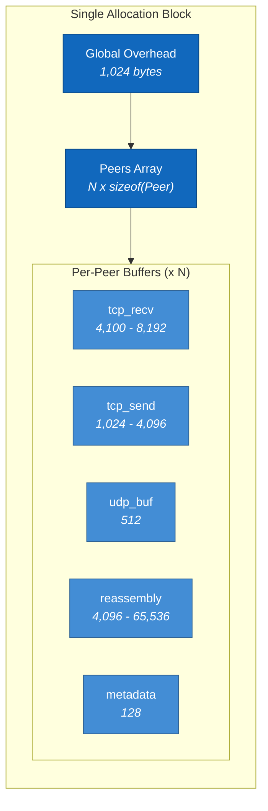

**Sizing**: On Classic Mac, `FreeMem() x 75%` determines the budget. Buffer sizes scale with available memory (3 tiers). Max 32 peers. Zero malloc after init.

## Chunking and Reassembly Sequence

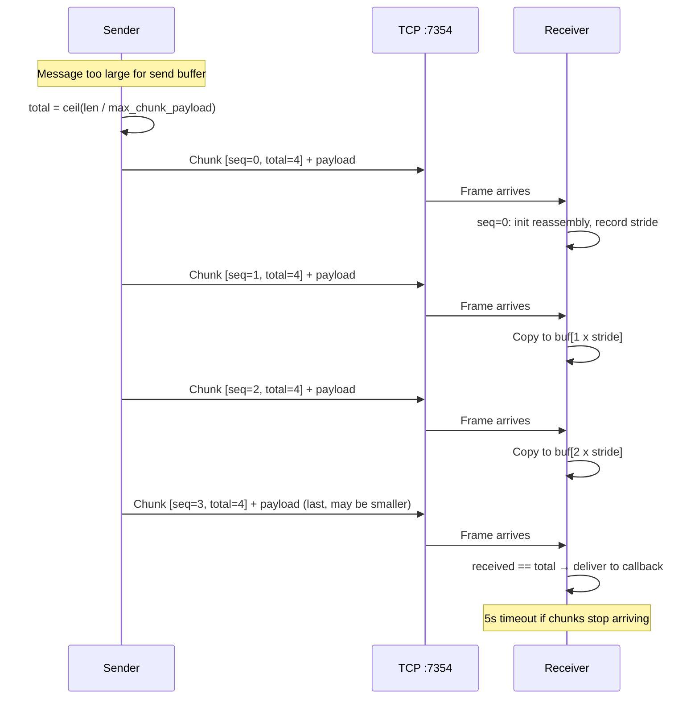

## Poll Cycle

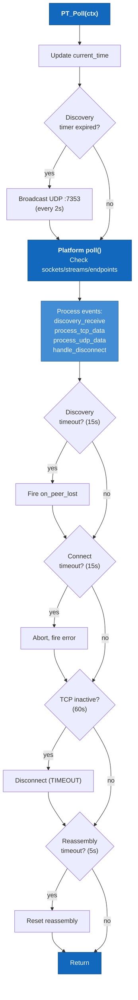
