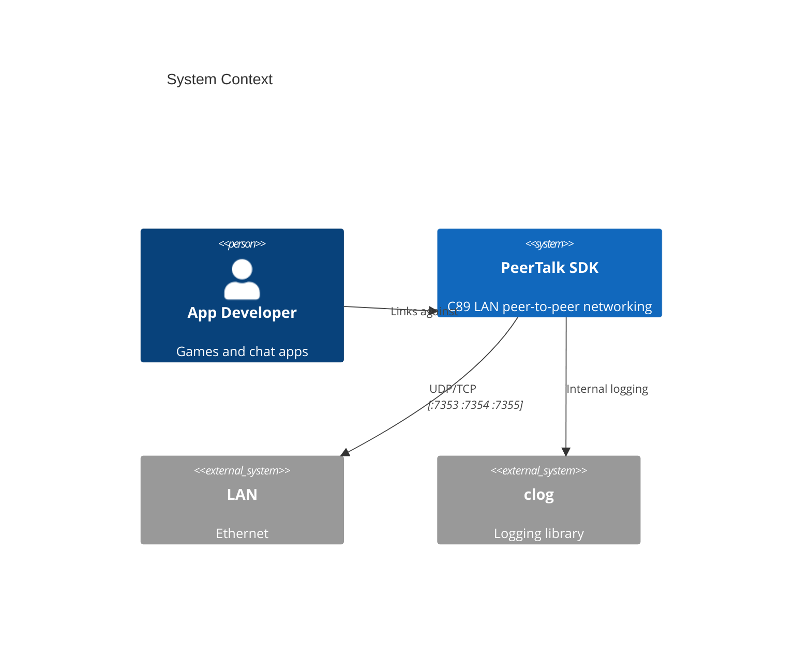
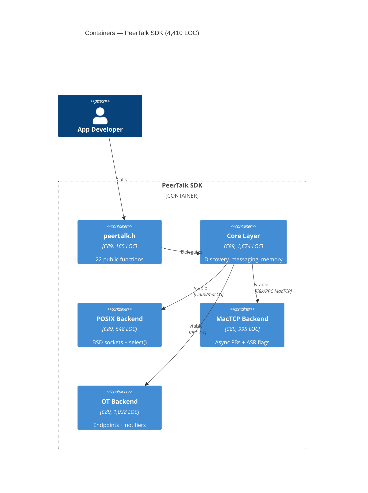
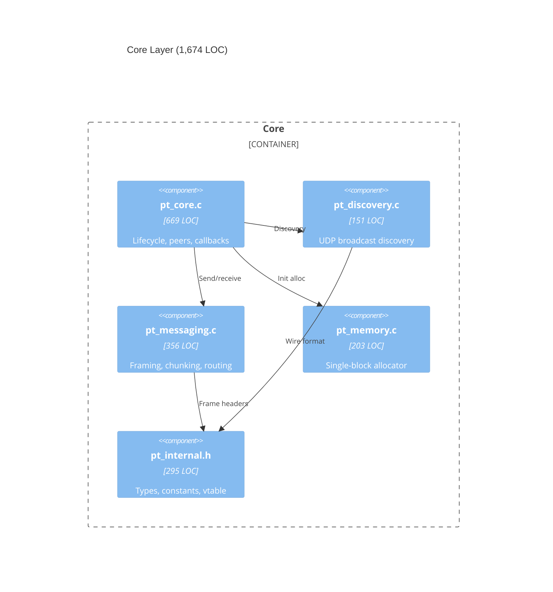
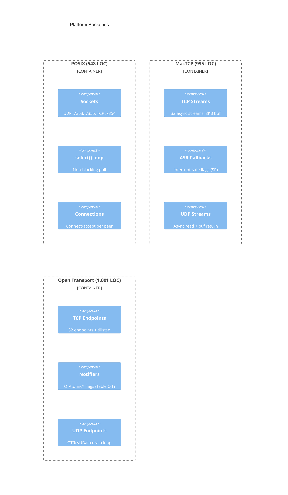
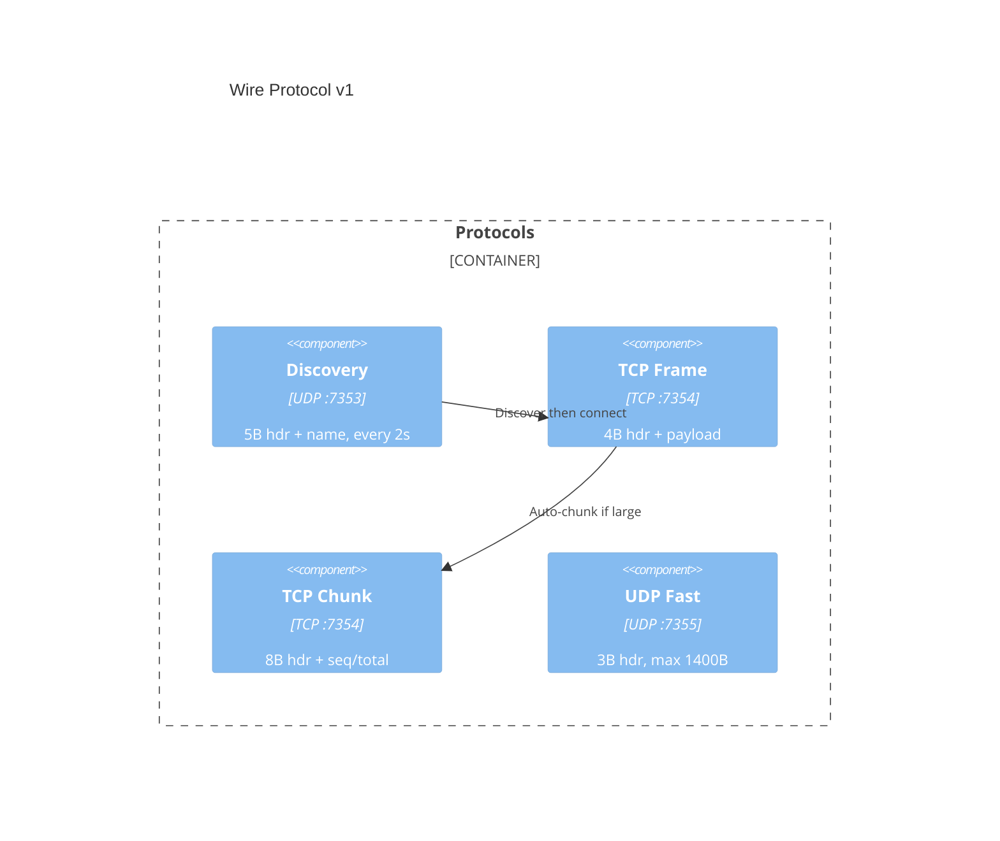
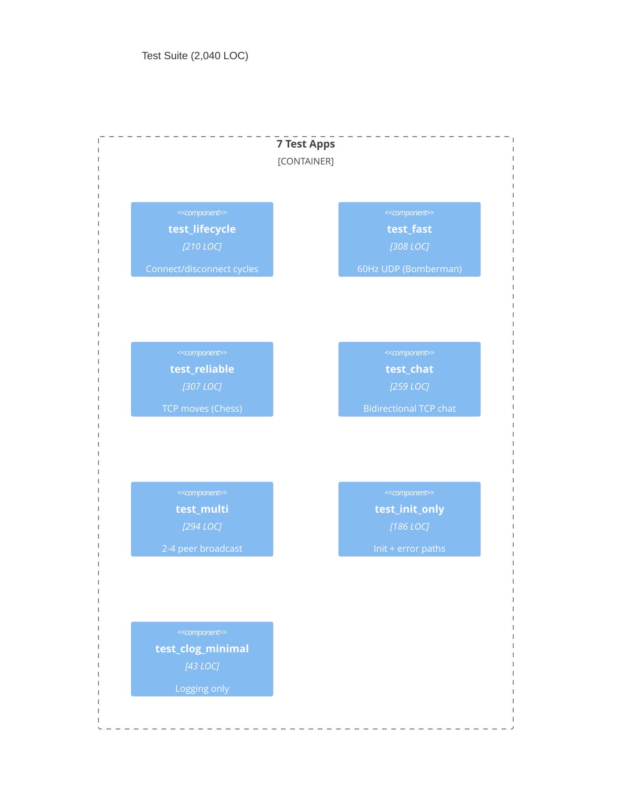

# PeerTalk Architecture

> Auto-generated by `/architecture` skill. Do not edit manually.

## Level 1: System Context



## Level 2: Container



## Level 3: Component — Core



## Level 3: Component — Backends



## Level 4: Deployment

```mermaid
C4Deployment
    title Test LAN Deployment

    Deployment_Node(macse, "Mac SE", "68000 8MHz, 4MB RAM, System 6.0.8") {
        Deployment_Node(macse_app, "PeerTalk", "68k MacTCP build")
    }

    Deployment_Node(p6200, "Performa 6200", "PPC 603 100MHz, 40MB RAM, System 7.5.3") {
        Deployment_Node(p6200_app, "PeerTalk", "PPC MacTCP build")
    }

    Deployment_Node(p6400, "Performa 6400", "PPC 603e 180MHz, 48MB RAM, System 7.6.1") {
        Deployment_Node(p6400_app, "PeerTalk", "PPC Open Transport build")
    }

    Deployment_Node(linux, "Linux Box", "x86_64") {
        Deployment_Node(linux_app, "PeerTalk", "POSIX build")
    }

    Rel(macse_app, linux_app, "Ethernet", "UDP/TCP")
    Rel(p6200_app, linux_app, "Ethernet", "UDP/TCP")
    Rel(p6400_app, linux_app, "Ethernet", "UDP/TCP")
    Rel(macse_app, p6400_app, "Ethernet", "UDP/TCP")
    Rel(p6200_app, p6400_app, "Ethernet", "UDP/TCP")
    Rel(macse_app, p6200_app, "Ethernet", "UDP/TCP")
```

## Wire Protocol



## Test Suite


