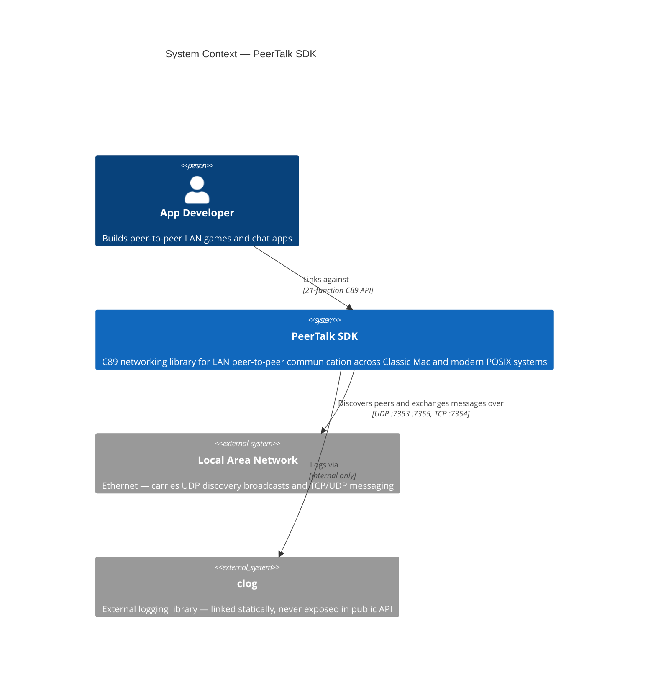
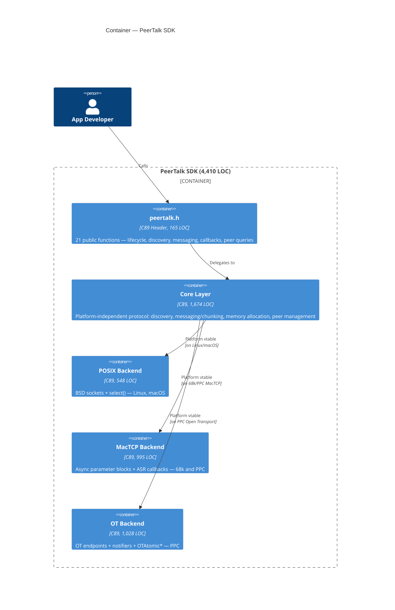
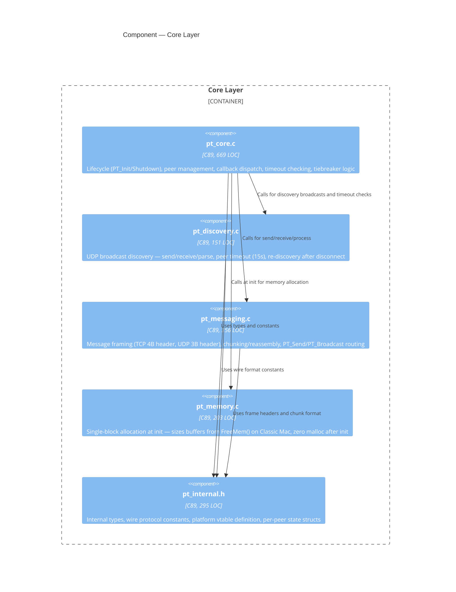
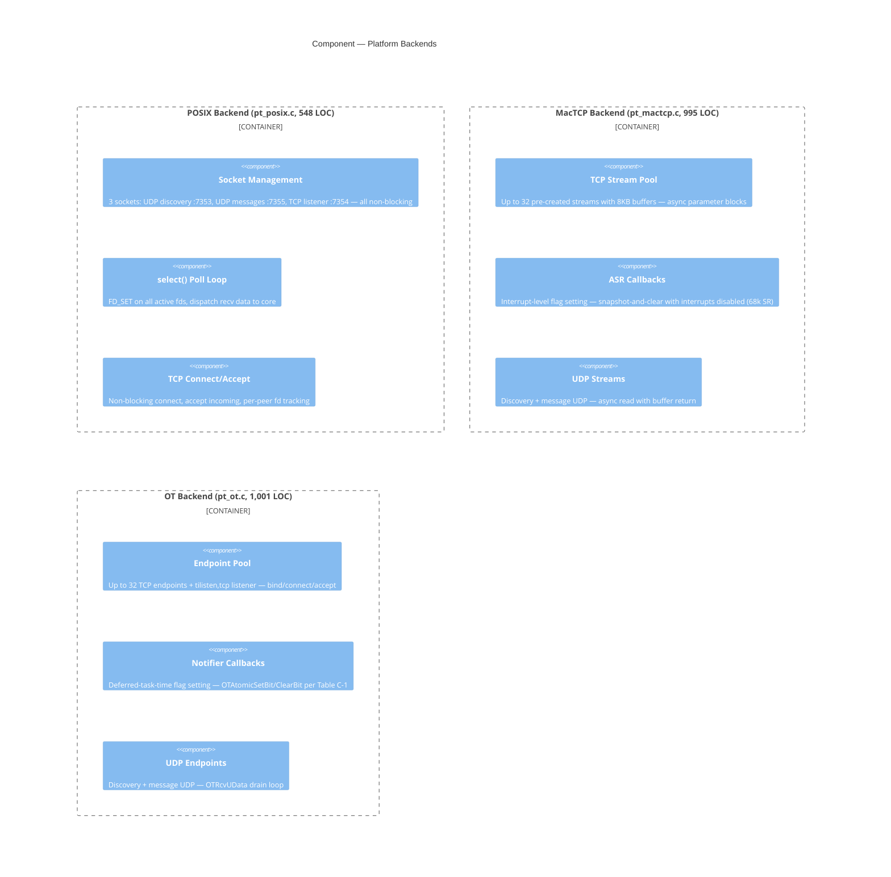
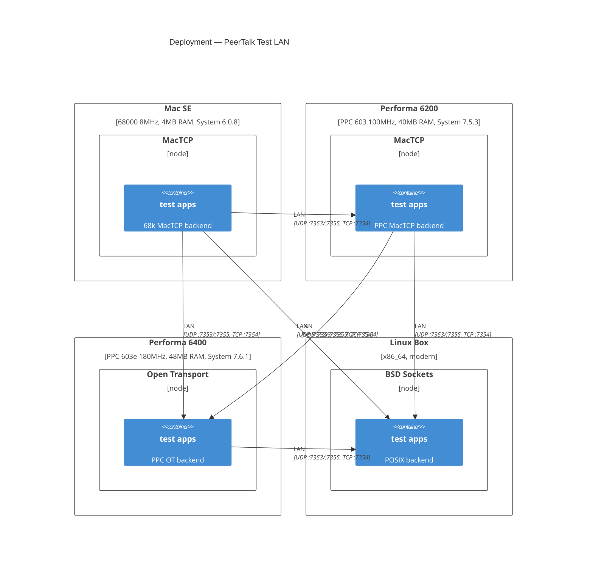
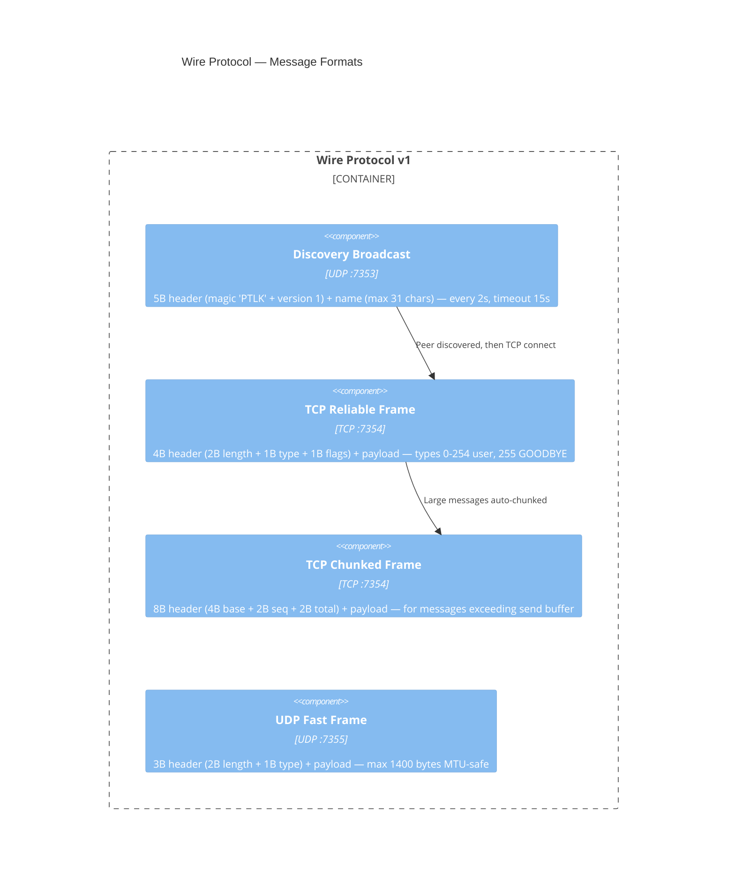
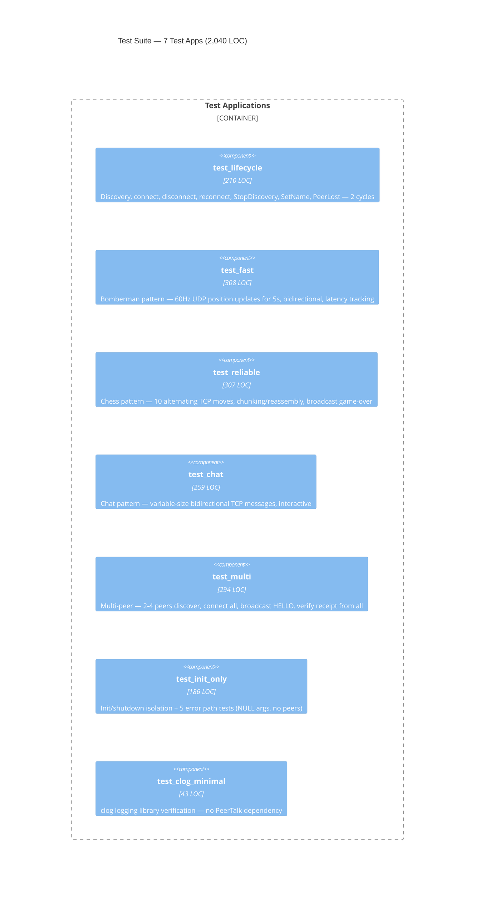

# PeerTalk Architecture

> Auto-generated by `/architecture` skill. Do not edit manually.

## Level 1: System Context

## Level 2: Container

## Level 3: Component (Core Layer)

## Level 3: Component (Platform Backends)

## Level 4: Deployment

## Wire Protocol

## Test Suite

